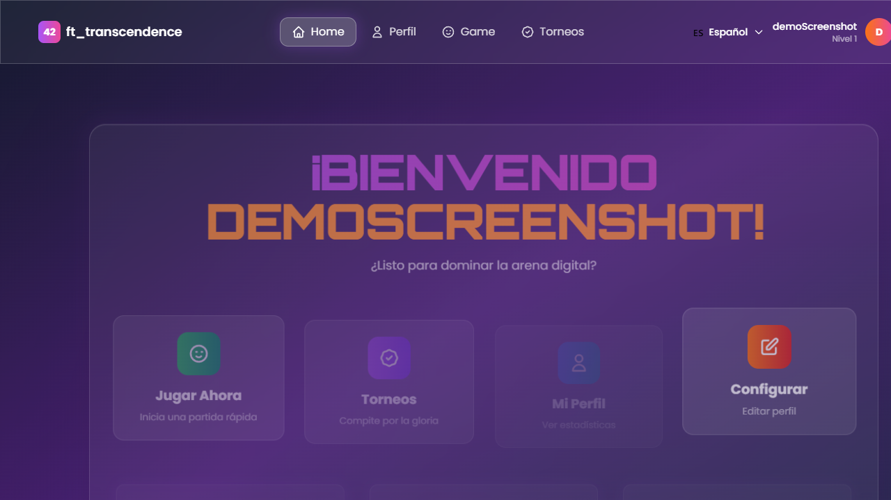
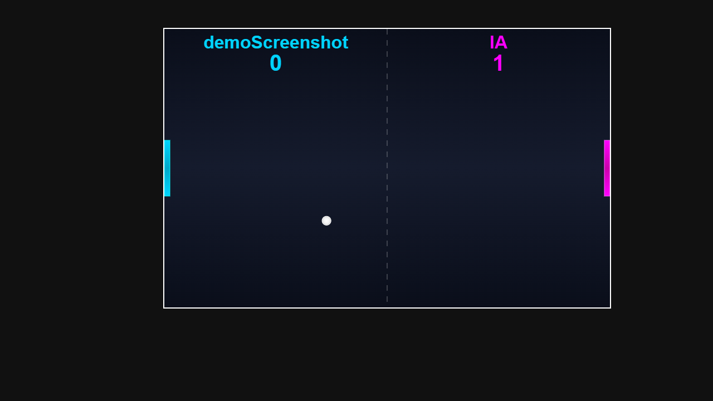
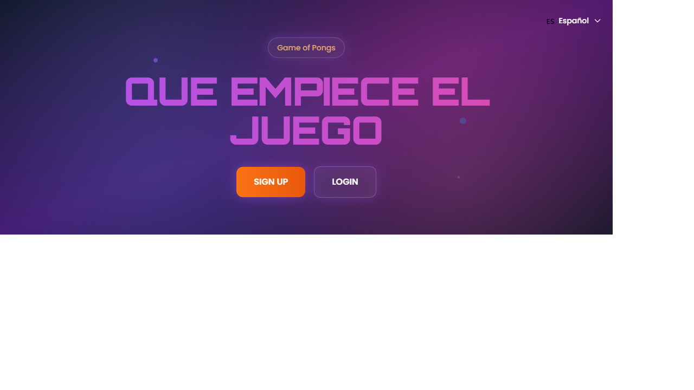
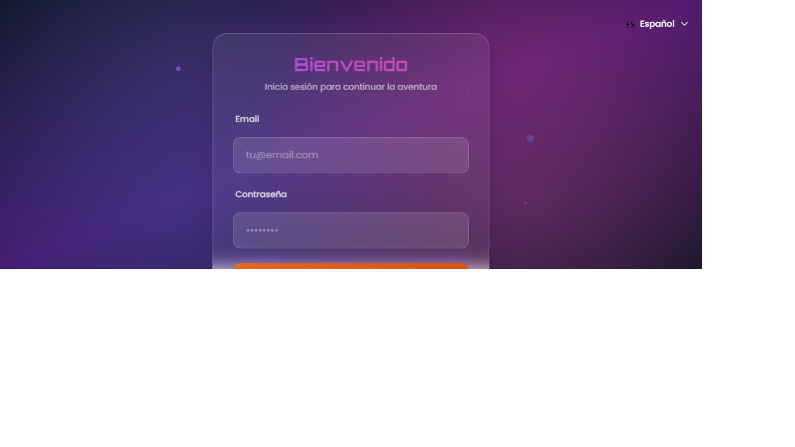
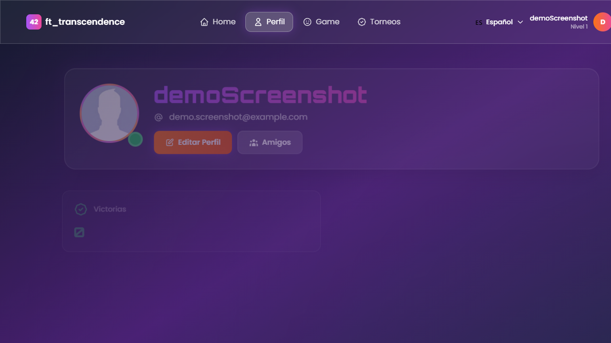
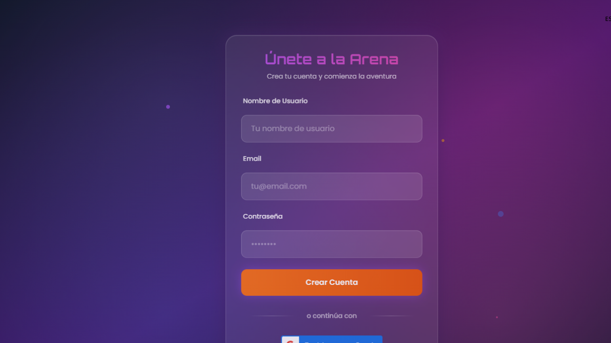
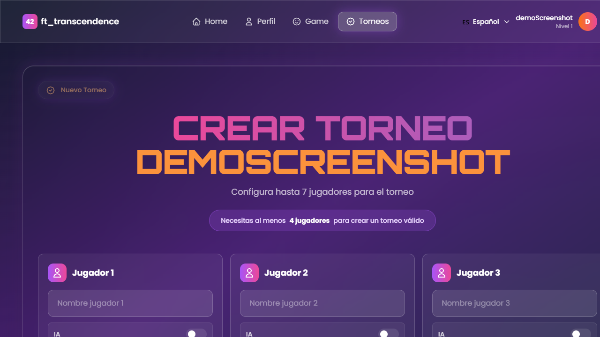

# Transcendence

  

Full-stack web app with authentication, gameplay, and containerized deployment.

## About This Project

### What It Does

Transcendence is a full-stack web application built around a real-time, browser-playable version of Pong, wrapped with the features a real product needs: account creation and login (including Google sign-in), user profiles with match history and stats, a friends list, and both quick matches (including a play-against-AI mode) and multi-player tournaments.

The backend is a Fastify (Node.js) server that serves the app, exposes the game and account APIs, and drives real-time gameplay over WebSockets, backed by SQLite for persistence. The frontend is server-rendered with EJS and styled with Tailwind CSS. The whole stack runs behind Nginx inside a single Docker Compose service, self-signed TLS certificates included, so it can be deployed with one command.

### Purpose

It evaluates the ability to design and ship a complete web product end-to-end: authentication and session security, real-time bidirectional communication for gameplay, relational data modeling for users/matches/tournaments, and a reproducible containerized deployment, rather than any single isolated technique.

## Stack

- School: 42
- Primary language: JavaScript/TypeScript + Fastify + Docker
- Scope: one repository per project

## Skills Demonstrated

`Full-stack development` | `Authentication/security` | `Real-time WebSockets` | `Relational data modeling` | `Containerized deployment`

## Features

- User authentication and session management
- Real-time multiplayer gameplay via WebSockets
- Full deployment with Docker Compose and Nginx as reverse proxy
- Tailwind CSS frontend with a Fastify backend

## Review Focus

- Look for the full product surface: authentication, profiles, match history, friends, AI mode, and tournaments.
- Review WebSocket gameplay flow and how server state stays consistent during real-time matches.
- Notice the deployment story: app, backend, database, TLS, and reverse proxy running as a reproducible stack.

## Product Walkthrough

Transcendence is the closest project in this portfolio to a real production application. It is not just a Pong clone: it combines account management, persistent user data, matchmaking-style flows, profile pages, match history, tournament navigation, real-time gameplay, and deployment concerns into one cohesive product.

From a reviewer's point of view, the most interesting part is how many concerns have to work together at once. The frontend has to guide the user through authentication, navigation, profile state, and gameplay screens. The backend has to keep sessions, game state, and persisted data consistent. The deployment layer has to make the whole app reproducible through Docker and Nginx instead of relying on a local-only setup.

## Architecture Notes

- **Frontend**: server-rendered EJS views styled with Tailwind CSS, organized around product screens such as landing, auth, dashboard, profile, gameplay, and tournament flow.
- **Backend**: Fastify application exposing account, game, and page routes while coordinating real-time gameplay through WebSockets.
- **Persistence**: SQLite-backed data for users, matches, and related product state.
- **Deployment**: Docker Compose, Nginx, and self-signed TLS certificates provide a repeatable local production-style environment.
- **Real-time layer**: WebSocket communication keeps the game loop interactive in the browser and forces the server to manage shared match state carefully.

## Screenshots

*Main authenticated area where the player can navigate to game and account features.*

*Browser-based Pong match, the real-time core of the project.*

*Entry point for the product, introducing the application before authentication.*

*Authentication screen used to start a session.*

*Profile view with player identity and progress-oriented information.*

*Registration flow for creating a player account.*

*Tournament flow showing the multiplayer/product layer around the game.*

## How to Run

Prerequisites (Docker option): Docker and Docker Compose, plus a `.env` file at the project root with `COOKIE_SECRET`, `JWT_SECRET`, and `GOOGLE_CLIENT_ID` (a placeholder value works if Google sign-in is not needed). Prerequisites (local option): Node.js 20+ and npm.

Docker option (recommended):

~~~bash
docker compose up --build -d
~~~

Open: https://localhost:10000

Local option (without Docker):

~~~bash
npm install
npm run build
npm run dev
~~~

## Testing

No dedicated testing scripts were detected at the project root.

## Notes

- This repository is part of the 42 portfolio.
- Commands are intended for local execution for review and evaluation.

## Author

anapaulapgavilan
